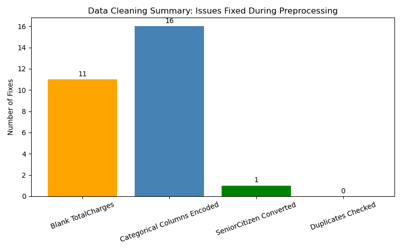
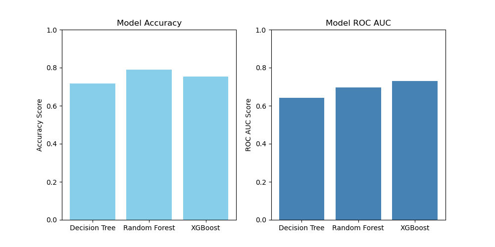

# 📊 RetainSmart: Using ML to Forecast Telecom Churn

This project uses customer data from a telecom company to identify which customers are at risk of churning. By applying data cleaning, exploratory analysis, and machine learning models, we aim to uncover patterns in customer behavior and help businesses retain valuable users.

---

## 🎯 Objectives

- 🧹 Clean and preprocess customer records
- 📊 Explore churn patterns with data visualization
- 🧠 Train multiple classification models
- 🏆 Select the best-performing model based on key metrics
- 💼 Recommend strategies for proactive retention

---

## 📁 Dataset Overview

- **Source**: [Kaggle - Telco Customer Churn](https://www.kaggle.com/datasets/blastchar/telco-customer-churn)
- **Size**: 7,043 rows × 21 columns
- **Fields include**: demographics, services subscribed, billing, contract details, and churn outcome

---

## 🧹 Data Cleaning Summary

We removed rows with invalid or missing values (such as blank `TotalCharges`) and converted object types (e.g., `SeniorCitizen` from 0/1 to categorical). Here's how many records remained after cleaning:

---

## 📊 Exploratory Analysis Highlights

- Customers with **month-to-month contracts** have the highest churn rate
- **High monthly charges** and **low tenure** are strong churn indicators
- **Fiber optic users** are more likely to churn than DSL or no-internet users

---

## 🤖 Models Trained & Compared

| Model               | Notes                                        |
|--------------------|----------------------------------------------|
| 🧾 Logistic Regression | Simple, interpretable baseline              |
| 🌲 Decision Tree       | Rule-based logic, prone to overfitting     |
| 🌳 Random Forest       | Ensemble model with stronger generalization |
| ⚡ XGBoost (Best)       | Boosted tree model, best ROC AUC & recall  |

---

## 🧪 Model Performance Comparison

We compared models using **Accuracy** and **ROC AUC**, especially focusing on recall for churned customers due to class imbalance.

---

## 📈 Business Impact

By identifying churn-prone customers early:
- 📞 Call center and CRM teams can launch retention offers
- 🛠 Product teams can improve onboarding and services
- 💸 Marketing can personalize incentives to reduce revenue loss

---

## 🛠 Tools & Technologies

- **Languages**: Python  
- **Libraries**: Pandas, NumPy, Seaborn, Matplotlib, Scikit-learn, XGBoost  
- **Environment**: Jupyter Lab (via Anaconda)

---

## 📂 Project Structure

telco-customer-churn/
├── Telco_Customer_Churn_Analysis.ipynb
├── README.md
├── requirements.txt
├── WA_Fn-UseC_-Telco-Customer-Churn.csv
└── images/
├── model_comparison.png
└── data_cleaning_impact.png

---

## 🚀 Next Steps

- 🔄 Add hyperparameter tuning (GridSearchCV, RandomizedSearchCV)
- 🌐 Deploy using Streamlit for live churn prediction
- 📊 Build a Tableau dashboard for business reporting

---

## 🙌 Acknowledgments

- Dataset by [blastchar on Kaggle](https://www.kaggle.com/datasets/blastchar/telco-customer-churn)
